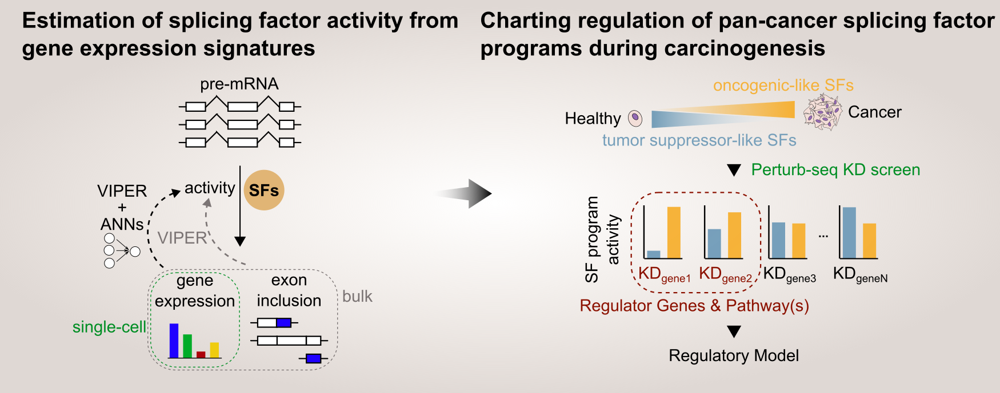

# Using single-cell perturbation screens to decode the regulatory architecture of splicing factor programs

Adapting splicing factor activity analysis to gene expression signatures to study the regulation of splicing factors from single-cell Perturb-seq screens.

This repository contains the workflows (from data download to figures) used in the publication.



## Structure
- `config.yaml`
- `environment.yaml`
- `data`
- `results`
- `src`
- `support`
- `workflows`
    1. `obtain_data`([Details](https://github.com/MiqG/publication_regulation_cancer_asprograms/tree/master/workflows/01-obtain_data)): raw data download
    2. `preprocess_data` ([Details](https://github.com/MiqG/publication_regulation_cancer_asprograms/tree/master/workflows/02-preprocess_data)): preparing raw data for analysis
    3. `new_empirical_network` ([Details](https://github.com/MiqG/publication_regulation_cancer_asprograms/tree/master/workflows/03-new_empirical_network)): extending exisiting splicing factor-exon networks
    4. `sf_programs_in_differentiation` ([Details](https://github.com/MiqG/publication_regulation_cancer_asprograms/tree/master/workflows/04-sf_programs_in_differentiation)): activity analysis of cancer splicing programs during developmental tissue differentiation
    5. `activity_estimation_w_genexpr` ([Details](https://github.com/MiqG/publication_regulation_cancer_asprograms/tree/master/workflows/05-activity_estimation_w_genexpr)): splicing factor activity estimation from gene expression signatures using shallow ANNs
    6. `carcinogenic_switch_regulation` ([Details](https://github.com/MiqG/publication_regulation_cancer_asprograms/tree/master/workflows/06-carcinogenic_switch_regulation)): genes and pathways influencing carcinogenic regulation of splicing factors
    7. `prepare_submission` ([Details](https://github.com/MiqG/publication_regulation_cancer_asprograms/tree/master/workflows/07-prepare_submission)): prepare supplementary tables and intermediate files

## Installation and requirements
### 1. Conda/mamba Environment

We recommend using mamba.

```shell
mamba env create -f environment.yaml
```

If you need to avoid accessing repo.anaconda.com, run this before (Based on https://github.com/mamba-org/mamba/issues/656):
```shell
conda config --add channels conda-forge
conda config --add channels bioconda
conda config --add channels pytorch
conda config --remove channels defaults
```

### 2. `src/vipersp` locally to access Pytorch model architectures

```shell
conda activate publication_regulation_cancer_asprograms
pip install -e src/vipersp
```

### 3. `vast-tools` (manual installation)
Based on https://github.com/vastgroup/vast-tools?tab=readme-ov-file#installation.

Clone vast-tools repository in your desired path:
```{shell}
cd ~/repositories # or your desired path
git clone https://github.com/vastgroup/vast-tools.git
```

Download VastDB Homo sapiens (Hs2) genome assembly in your desired path:
```{shell}
cd ~/projects/publication_regulation_cancer_asprograms/data/raw/VastDB/assemblies # or your desired path
wget https://vastdb.crg.eu/libs/vastdb.hs2.20.12.19.tar.gz
tar -xvzf vastdb.hs2.20.12.19.tar.gz
```

Update `config.yaml` file accordingly with the path to the vast-tools directory and to the VastDB genome assembly.

## Usage
All workflows were written as `snakemake` pipelines. To execute each workflow:

1. activate the project's environment
```{shell}
conda activate publication_regulation_cancer_asprograms
```

2. use the following command format:
```{shell}
snakemake -s <workflow_name>.smk --cores <number_of_cores>
```

In case you want to run the workflows on your cluster, refer to [snakemake documentation](https://snakemake.readthedocs.io/en/stable/executing/cluster.html) to adapt the command according to your job submission scheduler.


## Issues
Please, report any issues here: https://github.com/MiqG/publication_regulation_cancer_asprograms/issues


## Authors
- [Miquel Anglada Girotto](https://orcid.org/0000-0003-1885-8649)
- [Samuel Miravet-Verde](https://orcid.org/0000-0002-1542-5912)
- [Luis Serrano](https://orcid.org/0000-0002-5276-1392)


## Citation
```
@article{anglada2025using,
  title={Using single-cell perturbation screens to decode the regulatory architecture of splicing factor programs},
  author={Anglada-Girotto, Miquel and Miravet-Verde, Samuel and Serrano, Luis},
  journal={bioRxiv},
  pages={2025--02},
  year={2025},
  publisher={Cold Spring Harbor Laboratory}
}
```
URL: https://www.biorxiv.org/content/10.1101/2025.02.07.637061v1.full
